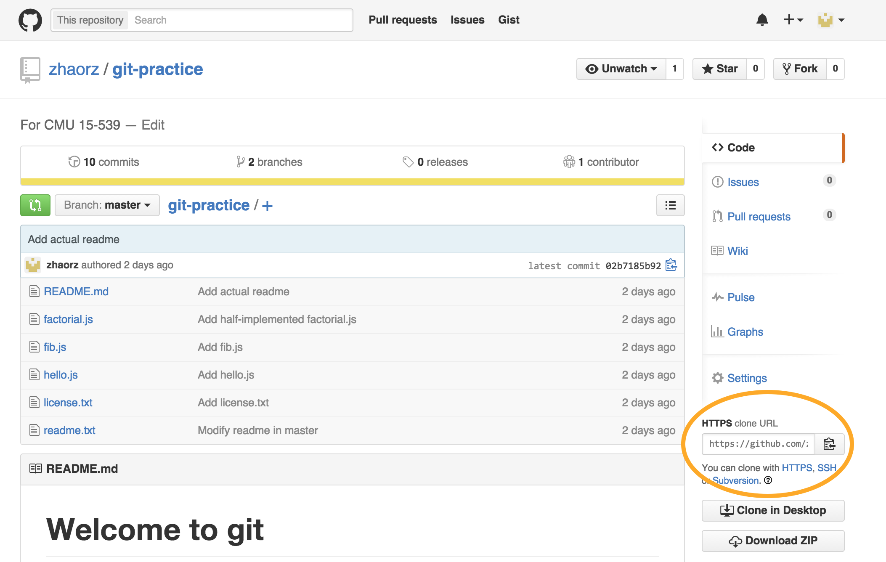

# Welcome to git

This is a brief overview of several main features of git. We'll also walk you through a sample repository to see some of these features in action.

This document may seem a bit long, but we include all of the output from the commands we show. You should, however, expect to spend ~30-60 minutes following the walkthrough if this is your first time using git & Github.

**Required reading:** [Git Guide](http://rogerdudler.github.io/git-guide/) - This is a brief intro to the _syntax_ of several git commands. We'll go over what they do in more detail here.

**Note:** Many syntactical aspects of git are glossed over. We mainly explain when you would use these commands. Full documentation can be found at [git official documentation](https://git-scm.com/doc).

## Index

<!-- MarkdownTOC -->

- [What is git?](#what-is-git)
- [What is Github?](#what-is-github)
- [Local git usage](#local-git-usage)
    - [Create a project folder](#create-a-project-folder)
    - [git init](#git-init)
    - [git status](#git-status)
    - [Add a new file](#add-a-new-file)
    - [git add](#git-add)
    - [git commit](#git-commit)
        - [A simpler commit](#a-simpler-commit)
    - [Quick Review](#quick-review)
    - [git branch](#git-branch)
    - [git log](#git-log)
    - [git merge](#git-merge)
    - [Deleting branches](#deleting-branches)
    - [git stash](#git-stash)
    - [Fixing merge conflicts](#fixing-merge-conflicts)
    - [Summary: local git](#summary-local-git)
- [Github (online)](#github-online)
    - [git clone](#git-clone)
    - [git pull](#git-pull)
    - [git push](#git-push)
    - [git remote add origin (advanced)](#git-remote-add-origin-advanced)
    - [Set up a remote branch](#set-up-a-remote-branch)
    - [Summary: Github (git online)](#summary-github-git-online)
- [Appendix](#appendix)
    - [Writing good commit messages](#writing-good-commit-messages)
    - [Using Sublime for commit messages](#using-sublime-for-commit-messages)

<!-- /MarkdownTOC -->

## What is git?

Git is a tool used for version control. Every change you make to a piece of code is tracked, and you can always go back and look at earlier versions. Git has a variety of powerful features that you can use.

## What is Github?

Git itself is a tool on your local computer. Github is a website that stores copies of your local git folders online. It also allows us to collaborate with each other. Most projects you will be working on are online, so we will discuss how to go about working with them.

## Local git usage

For information on how to work with Github online repositories, skip to [Github](#github-online).

Here, we'll go through some basic adding, committing, branching and merging with a test repository.

Whenever code is posted that starts with `$`, it means it should be typed into a _shell_. The default Mac OS shell is its Terminal application. Windows users should have a special git shell that came with their git installation.

Lines that don't start with `$` are for output. The output posted in this walkthrough will be different from your output (in terms of paths, usernames, etc.).

Lines that start with `#` are comment lines. We include them for extra explanation when needed.

### Create a project folder

Git projects live inside a single parent folder. All subfolders inside this folder belong to the same git project.

```sh
# Create a project folder. (Windows: use 'New Folder' in Windows Explorer)
$ mkdir project
$ cd project        # (c)hange (d)irectories to the project
```

### git init

To start using git, use the command `git init`. Make sure you are in the correct directory (`project` in this case) and that there is no existing git information.

```sh
$ git init
Initialized empty Git repository in /Users/Richard/Desktop/project/.git/
```

This command creates a new git **repository**. A repository is simply a place to store files, like a folder, such that git can see them.

### git status

```sh
$ git status
On branch master

Initial commit

nothing to commit (create/copy files and use "git add" to track)
```

`git status` is the command you will use more often than any other. Use it to view the current state of the repository. Since we haven't added any files yet, it tells us `nothing to commit`. Don't worry about `On branch master` yet.

### Add a new file

Add a file called `readme.txt` to the `project` folder. Here's what my `readme.txt` looks like:

```
Hi! I'm a readme file.
Read me!
```

Now, let's try `git status` again.

```sh
$ git status
On branch master

Initial commit

Untracked files:
  (use "git add <file>..." to include in what will be committed)

    readme.txt

nothing added to commit but untracked files present (use "git add" to track)
```

It tells us that we have an **untracked file**, called `readme.txt`. In order for git to _keep track_ of files, you have to explicitly tell it. Git messages from `git status` are generally very helpful. In this case, it tells us to use `git add` to track our files.

### git add

```sh
# Add our new file
$ git add readme.txt

# Get the status after adding readme.txt
$ git status
On branch master

Initial commit

Changes to be committed:
  (use "git rm --cached <file>..." to unstage)

    new file:   readme.txt

```

The command `git add` takes in arguments for each file you want to add. In our case, we only have `readme.txt` to add, so we performed `git add readme.txt`.

**Tip:** `git add -A` will add (A)ll current files.

`git add` adds files to a **staging area**. This means that git is aware of the changes you made, but git will _not_ save these changes yet. To save them, we need to **commit**.

### git commit

Committing changes is like saving. Instead of saving a single file, the entire repository's current state is saved, sort of like a _snapshot_ at a precise moment in time. So, all changes in all files (that you added using `git add`) are **committed**.

Commits require a message that describes the changes you are saving. Keep them descriptive, but concise. If possible, limit the first line to <50 characters and put details after an empty line.

```sh
$ git commit
```

This will bring up a text editor, usually [vim](http://www.vim.org/), with the following message:

```

# Please enter the commit message for your changes. Lines starting
# with '#' will be ignored, and an empty message aborts the commit.
# On branch master
#
# Initial commit
#
# Changes to be committed:
#   new file:   readme.txt
#
```

**Do not panic!** Vim is scary (at first). [Here is a brief guide.](https://www.linux.com/learn/tutorials/228600-vim-101-a-beginners-guide-to-vim) You don't have to read it thoroughly, however, because to write a commit message, you only need these steps:

1. Press `i` to enter insert mode. In insert mode, vim is a normal text editor. You can type words, and use the arrow keys to move around.
1. Type your commit message. For example, `Add readme.txt`.
1. Press `<ESC>` to exit insert mode.
1. Press `:`. You will see at the bottom of the screen a `:`, which is a prompt to enter commands. Similar to `$` in a shell, but for vim.
1. Enter `wq`, then press return. `w` means (w)rite, and `q` means (q)uit. Thus, `wq` saves the message, then quits vim.

[How to make sublime pop up instead of vim.](#using-sublime-for-commit-messages)

[More information on commit messages.](#writing-good-commit-messages)

#### A simpler commit

If you're new to vim, or if you need to make a quick commit, then you can use an inline commit message.

```sh
# No vim required!
$ git commit -m "Add readme.txt"
[master (root-commit) 58ff24a] Add readme.txt
 1 file changed, 2 insertions(+)
 create mode 100644 readme.txt
```

The `-m` flag specifies a commit message, which should be supplied as a single or double quoted string. Multi-line messages are also allowed, just press return. Add a closing quote to end the message.

In the output, you will see `1 file changed, 2 insertions(+)`. The file changed is `readme.txt`, which we added. Since my file had 2 lines, git tells me that 2 insertions were made.

```sh
# After committing...
$ git status
On branch master
nothing to commit, working directory clean
```

If we check the status now, we should have a _clean working directory_. This means that there are no changes that git knows about. In other words, you're up to date.

### Quick Review

Now, let's go through the process of adding another file. I added `hello.js` that contains the following Javascript code:

```js
function hello() {
    console.log("Hello, world!")
}

```

A quick git status gets us:

```sh
$ git status
On branch master
Untracked files:
  (use "git add <file>..." to include in what will be committed)

    hello.js

nothing added to commit but untracked files present (use "git add" to track)
```

We want to add hello.js to the _staging area_, and _commit_ it.

```sh
$ git add hello.js              # git add -A would also work here
$ git commit -m "Add hello.js"
[master d936906] Add hello.js
 1 file changed, 4 insertions(+)
 create mode 100644 hello.js
```

You'll probably find yourself going through the add-commit cycle many times, which is normal. It's good to keep the changes you make organized in small chuncks.

### git branch

Consider yourself working in a large repository, with a lot of code. Let's say you want to add a new feature to your code. But, as you're implementing the new feature, you still want to be able to check back on your original code. This is a situation in which `git branch` is helpful.

Branches are like different pathways that your code takes. You create a new branch if you want to experiment with a new feature, or to fix a bug. Once satisfied, you can bring those changes back into the main pathway.

In our case, the main development 'pathway' is called the `master` branch. All repositories are initialized, by default, with a `master` branch.

Let's switch to a new branch to develop our feature, and add a new file.

```sh
# Create a new branch called 'feature'
$ git branch feature

# List all available branches (the * indicates current branch)
$ git branch -v
  feature d936906 Add hello.js
* master  d936906 Add hello.js

# Switch to the feature branch
$ git checkout feature
Switched to branch 'feature'

# Now, it shows that we're on feature
$ git branch -v
* feature d936906 Add hello.js
  master  d936906 Add hello.js
```

Note that `git checkout <branchname>` is used to switch between branches.

_Tip:_ `git checkout -b <branchname>` is shorthand for `git branch <branchname> && git checkout <branchname>`. (i.e. It creates a branch and switches to it automatically.)

Now, I'll add a file, `fib.js` with the following code:

```js
function fib(n) {
    if (n < 2)
        return n;
    else
        return fib(n - 1) + fib(n - 2);
}

```

and then add & commit the new, `fib.js` file.

```sh
$ git add -A        # shorthand, add everything
$ git commit -m "Add fib.js"
[feature d1a2d80] Add fib.js
 1 file changed, 7 insertions(+)
 create mode 100644 fib.js
```

Notice that in the commit output, we see `[feature ... ]` instead of `[master ... ]`. This is because the commit was applied in the `feature` branch. Thus, if we switch back to master, we shouldn't see `fib.js` at all.

```sh
$ git checkout master       # switch to branch 'master'
$ tree
.                           # fib.js doesn't exist in `master`
├── hello.js
└── readme.txt
```

_Tip:_ `tree` is a Unix command that lists the current files in a folder. You may need to install it, as Mac OS does not come with `tree` by default.

While we're still on branch `master`, let's make another file. Let's call it `license.txt`, and it has the following:

```
The MIT License (MIT)
Copyright (c) 2015 CMU 15-539
```

Again, we'll add & commit:

```sh
$ git add -A
$ git commit -m "Add license.txt"
[master 14976d1] Add license.txt
 1 file changed, 2 insertions(+)
 create mode 100644 license.txt
```

Great! Now we have an open source license for our git repository.

### git log

To see a list of a branch's commits, use `git log`. A log in the `master` branch gives us:

```sh
$ git log
commit 14976d11eaf53a3fec992dd7bdf275ac8ee3a9d3
Author: Richard Zhao <richardz@andrew.cmu.edu>
Date:   Thu Aug 27 15:29:37 2015 -0400

    Add license.txt

commit d93690619692784f57fa4185c7124ddf8e4ca0c8
Author: Richard Zhao <richardz@andrew.cmu.edu>
Date:   Thu Aug 27 15:01:21 2015 -0400

    Add hello.js

commit 58ff24ab80980e6efa85cc8879b47784177e7fa4
Author: Richard Zhao <richardz@andrew.cmu.edu>
Date:   Thu Aug 27 12:21:41 2015 -0400

    Add readme.txt
```

Each commit corresponds to a SHA-1 checksum hash (the string of numbers & letters). Additionally, there is authorship information, a date, and the commit message. Time spent writing detailed commit messages pays off when you want to find a specific commit after `git log`.

Most likely, your git logs will become longer and longer as you work on projects. Using the `--oneline` argument cleans things up nicely.

```sh
$ git log --oneline
14976d1 Add license.txt
d936906 Add hello.js
58ff24a Add readme.txt
```

### git merge

Assume you have finished developing your `feature` branch, and you want to move `fib.js` (the file in `feature`) back to `master`.

`git merge` is the command of choice. If `git branch` allowed us to split off of `master` to work independently, then `git merge` brings the two parts back together.

`git merge` merges a given branch into the active branch, so make sure you are currently in the desired _destination_ branch. If you want to merge the _source_ branch `feature` into _destination_ branch `master`:

```sh
$ git checkout master       # switch to destination
$ git merge feature         # merge feature into master
```

This will bring up another vim session, and ask for a commit message. Similar to `git commit`, we can also use the `-m` flag while merging to specify a message and skip using vim. Here's my commit message (inside vim).

```sh
Merge branch 'feature'

# Please enter a commit message to explain why this merge is necessary,
# especially if it merges an updated upstream into a topic branch.
#
# Lines starting with '#' will be ignored, and an empty message aborts
# the commit.
```

_Reminder:_ Use the vim command `:wq` to save the message and quit vim.

We'll get the following output:

```sh
# after merge
Merge made by the 'recursive' strategy.
 fib.js | 7 +++++++
 1 file changed, 7 insertions(+)
 create mode 100644 fib.js

# Look at current files
$ tree
.
├── fib.js              # This came from the 'feature' branch
├── hello.js
├── license.txt
└── readme.txt
```

Git tells us that it made a 'recursive' merge (there are other merge strategies too), and now `fib.js` is in master.

Let's look at the log, this time using the `--graph` flag, which shows branch structures.

```sh
$ git log --oneline --graph
*  fd6794b Merge branch 'feature'
|\
| * d1a2d80 Add fib.js
* | 14976d1 Add license.txt
|/
* d936906 Add hello.js
* 58ff24a Add readme.txt
```

Logs are displayed with most recent commits at the top. Each `*` corresponds with a commit, with its SHA-1 hash and message displayed on the right. The `master` branch is always the left-most path, a straight line.

We can see clearly where our `feature` branch _diverged_ from master. After diverging, we made a single commit, "Add license.txt", to the `master` branch, and another single commit, "Add fib.js", to the `feature` branch.

[Extra information on merge conflicts](#fixing-merge-conflicts)

### Deleting branches

After merging `feature` into `master`, you may decide that `feature` is no longer needed. No problem. Make sure you're in master, then delete the `feature` branch by passing the `-d` flag to `git branch`:

```sh
# Check that master is active
$ git branch -v
  feature d1a2d80 Add fib.js
* master  fd6794b Merge branch 'feature'

# Delete feature branch
$ git branch -d feature

# After:
$ git branch -v
* master fd6794b Merge branch 'feature'
```

### git stash

Sometimes, you will need to switch branches while you have unstaged work. You don't want to commit half-done work, so use `git stash`. `git stash` takes all of your uncommitted changes & modifications, and saves it. You can reapply these changes at any time.

Consider the following situation: you are in the middle of implementing `factorial.js` on master, but you need to quickly switch to a hotfix branch and take care of a more time-critical issue. The plan is to stash your current work, switch over, fix the issue, switch back, and reapply your changes from the stash.

```sh
$ git status
On branch master
Changes to be committed:
  (use "git reset HEAD <file>..." to unstage)

    modified:   factorial.js

# Need to switch to hotfix, stash your changes
$ git stash
Saved working directory and index state WIP on master: 85c0994 Fixed merge conflict
HEAD is now at 85c0994 Fixed merge conflict

# Check status again, now we have a clean working directory
$ git status
On branch master
nothing to commit, working directory clean

# Go and perform a hotfix
$ git checkout hotfix
```

When you want to switch back to master and continue working on `factorial.js`, you'll need to apply your stash.

```sh
# See available stashes
$ git stash list
stash@{0}: WIP on master: 85c0994 Fixed merge conflict

# Apply topmost stash (stash@{0})
$ git stash apply
On branch master
Changes to be committed:
  (use "git reset HEAD <file>..." to unstage)

    modified:   factorial.js

```

Applying the stash restores the changes we made to `factorial.js`. If there are multiple stashes in the list, you can apply specific ones. `git stash apply` is shorthand for `git stash apply stash@{0}`, the most recent stash.

Stashing is also used if you want to 'undo' any changes you've made since your last commit. Useful if you simply want to start over again.


### Fixing merge conflicts

A **merge conflict** occurs when two branches are merged, and the same line in the same file is changed in both branches. Git cannot decide which version to use on its own, so you must intervene.

Assume we modified the same line in `readme.txt` on both `master` and `feature` branches. Let's merge `feature` into `master` now.

```sh
$ git branch -v
  feature 734c84f Modify readme in feature
* master  bdbb683 Modify readme in master

# Merge
$ git merge feature
Auto-merging readme.txt
CONFLICT (content): Merge conflict in readme.txt
Automatic merge failed; fix conflicts and then commit the result.
```

Uh oh. We have a `Merge conflict in readme.txt`. **Remain calm and `git status`**.

```sh
$ git status
On branch master
You have unmerged paths.
  (fix conflicts and run "git commit")

Unmerged paths:
  (use "git add <file>..." to mark resolution)

    both modified:   readme.txt

no changes added to commit (use "git add" and/or "git commit -a")
```

We see, from the status output, that `readme.txt` was modified by both branches. Let's take a look at that file:

```
<<<<<<< HEAD
I'm modified in master.
=======
I'm modified in feature.
>>>>>>> feature
Read me!
```

Again, this looks pretty dicey, but let's analyze it. A merge conflict in a file is marked in between two series of septuple (7) angle brackets (`<<<<<<< ... >>>>>>>`).

The beginning of the conflict is `<<<<<<< HEAD` (`HEAD` always comes after the opening brackets) and the end has `>>>>>>>` followed by the source branch name (which is `feature` in this case).

Recall that we merged `feature` into `master`, so `feature` is our source.

In between the angle brackets is a line of 7 equals signs, `=======`. Above them is the conflicting code from the `destination` branch, and below it is the respective code from the `source` branch.

The way we resolve conflicts is by choosing either the code above `=======` or the code below, and deleting the rest. In fact, you can even delete the whole thing and rewrite whatever you want.

Assuming I want to keep the line `I'm modified in master`, I would delete lines 1, 3, 4, and 5. This leaves us with `readme.txt` looking like

```
I'm modified in master.
Read me!
```

Now, just add & commit. _Merge conflict resolved._
### Summary: local git

Everything we've done so far is local, meaning on your personal computer. We looked at all the basics you need to do the majority of git actions--adding, committing, branching, and merging.

Closing remarks:
 * `git add` only adds files to an intermediate, staging area. `git commit` does the final 'save'.
 * Make good commit messages. [See this for details.](#writing-good-commit-messages)
 * Use branching to add new features, while retaining a working copy on `master` at all times.

## Github (online)

Git locally is pretty powerful, but git's biggest strengths appear when it is used with Github. Github is a website where you can host repositories online, and collaborate with entire teams of developers on projects.

Prerequisites:
 * [Local git](#local-git-usage): Everything local works online as well.
 * [Github account](https://github.com/)
 * Push privilege to a repository. (More on this later)

For sake of example, I will use a personal repository, [.dotfiles](https://github.com/zhaorz/.dotfiles) that contains a few of my personal configuration files. Feel free to use the repository to practice, but you will not have push privileges. (e.g. you can edit the code locally, but Github will prevent you from uploading any changes)

It is recommended that you create a personal repository to practice Github online commands.

### git clone

In order to work on a repository, it is best to obtain a local copy using `git clone <url>`. This creates a carbon copy of the online repository on your own computer.

To get the URL of a repository, look towards the right-hand side of the screen.



```sh
# cd to whichever directory you want to clone into
$ cd ~

# Clone from a url into a new directory named 'dotfiles'
$ git clone https://github.com/zhaorz/.dotfiles.git dotfiles
Cloning into 'dotfiles'...
remote: Counting objects: 95, done.
remote: Compressing objects: 100% (63/63), done.
remote: Total 95 (delta 28), reused 81 (delta 17), pack-reused 0
Unpacking objects: 100% (95/95), done.
Checking connectivity... done.

# Change directories into dotfiles
$ cd dotfiles
```

Now, there is a carbon copy of the online repository inside `dotfiles`, in which all of the [local git](#local-git-usage) commands apply.

**Note:** Cloning a git repository automatically creates a `master` branch. `master` is the default branch for all repositories, even ones created with `git init` locally.

### git pull

Oftentimes on online repositories, you'll be working with a team of other developers. As everyone is working at the same time, you will want to periodically _update_ your repository with changes from other people.

```sh
# Get updates from the online repository
$ git pull origin master
remote: Counting objects: 6, done.
remote: Compressing objects: 100% (2/2), done.
remote: Total 6 (delta 4), reused 6 (delta 4), pack-reused 0
Unpacking objects: 100% (6/6), done.
From https://github.com/zhaorz/.dotfiles
 * branch            master     -> FETCH_HEAD
   82e850b..504fd1c  master     -> origin/master
Updating 82e850b..504fd1c
Fast-forward
 slate | 8 ++++++++
 zshrc | 2 +-
 2 files changed, 9 insertions(+), 1 deletion(-)
```

In the output, we see that 2 files on the master branch got updated, `slate` and `zshrc` (don't worry about what any of these files are, this is just for example's sake).

The command, `git pull <source> <destination>` finds any changes in the `<source>` branch and **pulls** them into the `<destination>` branch. The name `origin` is the default name of the repository living on Github.com, if you cloned using `git clone`. `master` is the local, master branch.

_Tip:_ You can use the shorthand, `git pull`, to pull changes from `origin` into your active branch without explicitly typing it.

### git push

If `pull` is used to update yourself from the online repository (also called the remote repository), then `push` is the command used to update the online repository using your local changes.

**Remember to pull before pushing.** You want to be as up to date as possible before making additional updates. Git will not let you push otherwise.

Let's consider that you've added some new files to our local repository, `dotfiles`, and you want to push these up to the remote (i.e. online) repository.

If `git pull` outputs `Already up-to-date`, then you're good to go. It means there are no changes on the remote repository that you don't already have.

`git status` when working with remotes works a bit differently. In this example, we added a file to our local repository. Thus, our local copy is 'more up-to-date' than the remote one. Thus, the output tells us "Your branch is ahead of 'origin/master' by 1 commit".

```sh
# Make sure you are up to date by pulling
$ git pull
Already up-to-date.

# Check your status one last time
$ git status
On branch master
Your branch is ahead of 'origin/master' by 1 commit.
  (use "git push" to publish your local commits)
nothing to commit, working directory clean

# Add your changes to the remote
$ git push
Counting objects: 2, done.
Delta compression using up to 4 threads.
Compressing objects: 100% (2/2), done.
Writing objects: 100% (2/2), 245 bytes | 0 bytes/s, done.
Total 2 (delta 1), reused 0 (delta 0)
To https://github.com/zhaorz/.dotfiles.git
   504fd1c..fe1f197  master -> master
```

The final line, `504fd1c..fe1f197  master -> master`, indicates that we have successfully moved the remote `master` up by a number of commits. In other words, the online repository has been successfully updated.

_Note:_ If you are attempting this example verbatim, you will receive errors and be unable to push successfully. This is because your Github account does not have 'push privileges' for the repository. Again, to try out clone/pull/push, it's best to start your own practice repository on Github.

### git remote add origin (advanced)

To tell a _local_ repository about its online, hosted counterpart, we will **add a remote origin**. For example usage, I've created a repository on Github with everything we did in [local git](#local-git-usage).

```sh
$ git remote add origin https://github.com/zhaorz/git-practice.git
```

This command follows the form `git remote add <name> <url>`. `origin` is the standard name used for Github.com hosted remotes. The command tells your local repository that there exists a **remote** repository online.

```sh
# Check that the remote was configured correctly
$ git remote show origin
* remote origin
  Fetch URL: https://github.com/zhaorz/git-practice.git
  Push  URL: https://github.com/zhaorz/git-practice.git
  HEAD branch: (unknown)
```

If you have push privileges to the remote, you can push your local changes to that repository. Remember to pull first!

```sh
$ git pull
Already up-to-date

# Push local changes to the new origin
$ git push -u origin master
Counting objects: 24, done.
Delta compression using up to 4 threads.
Compressing objects: 100% (19/19), done.
Writing objects: 100% (24/24), 2.18 KiB | 0 bytes/s, done.
Total 24 (delta 7), reused 0 (delta 0)
To https://github.com/zhaorz/git-practice.git
 * [new branch]      master -> master
Branch master set up to track remote branch master from origin.
```

The `-u` flag sets up tracking information for the remote branch. In other words, `git push` and `git pull` will work as expected: pushing and pulling from the remote repository. As git puts it, "Branch master set up to track remote branch master from origin."

If you do not have push privileges, you can still configure `git pull` to update your local repository from the remote origin.

```sh
# Configure upstream without needing to push
$ git branch --set-upstream-to=origin/master
Branch master set up to track remote branch master from origin.
```

### Set up a remote branch

Previously, we discussed how to add a remote origin to a local repository. The remote we added was set to track master. But what if we want to track our `feature` branch?

Before, we `git push -u origin master` to set up the remote origin for master. Like most git commands, push is of the form `git <command> <source> <destination>`. Since `push` deals with branches, (and source is akin to remote while destination is similar to local) it is `git push <remotebranch> <localbranch>`. So,

```sh
$ git push -u origin feature
Total 0 (delta 0), reused 0 (delta 0)
To https://github.com/zhaorz/git-practice.git
 * [new branch]      feature -> feature
Branch feature set up to track remote branch feature from origin.
```

will add remote origin tracking to our feature branch. If the branch doesn't exist on the remote yet (like in the example), Github will kindly create one. Similarly, if you do not have push privileges,

```sh
$ git branch --set-upstream-to=origin/feature
Branch feature set up to track remote branch feature from origin.
```

This will fail if `origin/feature` does not exist.

### Summary: Github (git online)

A remote repository (one hosted on github.com) is just like the one on your local computer. The only difference is the way you update the remote. Use `git pull` to get updates from the remote and `git push` to send your changes to the remote. This gives us the following workflow (when making changes)

<h4 style="text-align: center;">add => commit => pull => push</h4>

Closing remarks:
 * Remotes are almost identical to local ones. Don't be intimidated.
 * Push before you pull: keep yourself up-to-date.
 * Write good commit messages. Always, but especially important when you are working on a team.


## Appendix

### Writing good commit messages

<a style="text-align: center;" href="http://xkcd.com/1296/">
    
</a>

**TL;DR**
 * First line of message: keep it short, first letter capitalized.
 * Line break after first line & any details after it.

It may not seem like it at first, but **commit messages matter**. You may find yourself needing to refer back to a commit to see how you fixed a bug, or implement a feature. Sometimes, you even need to revert a commit, if something terrible happened.

Commit messages are also a documentation of your work, similar to a timesheet. When you submit work, you want to clearly state what you accomplished so that someone else can quickly understand what was done.

Writing a 'good' commit doesn't take much effort, and it helps everyone (including yourself) immensely.

A sample, 'good' commit:

```
Fix Firefox window size issue

Firefox exercises were displaying too large. The fix is to use the innerWidth
and innerHeight methods to set the dimensions of the exercise-outer-container div. Using jQuery .width and .height were assigning resulting values that were too large.

Additionally, getWindowWidth & getWindowHeight methods added to `display`
object in case further browser issues arise.

See http://bugs.jquery.com/ticket/4687
```

You should try to keep the first line of a commit as concise as possible (shoot for under 50 characters). This is to help readability when someone does a `git log` or browses commits on Github. There's no hard limit, just be reasonable.

Any details should be placed after a line break, with _decent_ grammar. Bullets are totally ok, we just want people to be able to understand all commit messages without having to decipher too much.

For short commits, a single line is often enough:

```sh
$ git commit -m "Add new button colors"
```

Most of my commits start with something like "Add", "Fix", "Remove", "Clean", etc. This is personal preference.

For a more in depth discussion, [see this blog post by Chris Beams](http://chris.beams.io/posts/git-commit/).

---

### Using Sublime for commit messages

Vim is often frustrating to use for commit messages. To use Sublime instead, read [Sublime OS X Command line](https://www.sublimetext.com/docs/2/osx_command_line.html) from Sublime's documentation.


